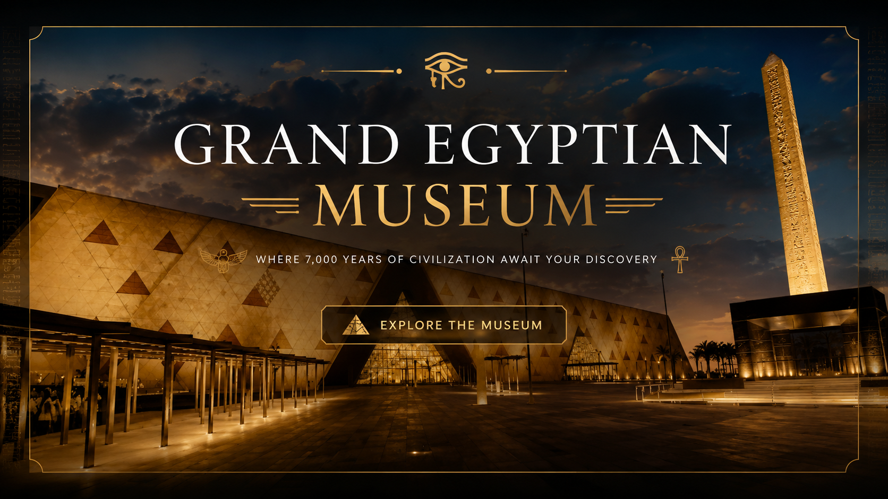

  

# Grand Egyptian Museum

# Grand Egyptian Museum

# Grand Egyptian Museum

A full-stack web application developed as a graduation project to provide a modern digital experience for the Grand Egyptian Museum. The platform allows visitors to explore museum collections, discover artifacts, and access museum information through an elegant and user-friendly interface.

## Features

- Browse museum collections
- View artifact details
- Responsive user interface
- User authentication
- Database integration
- Admin dashboard for content management

## Technologies Used

- Python
- Django
- HTML5
- CSS3
- JavaScript
- SQLite

## Project Status

This project is currently being refactored and improved to follow better software architecture and development practices.

## Future Improvements

- Better Django project structure
- Improved UI/UX
- Performance optimization
- Enhanced search and filtering
- 3D artifact visualization
- Online ticket booking

## Author

**Phebronia Emad**

Management Information Systems Graduate  
Passionate about Software & Web Development
